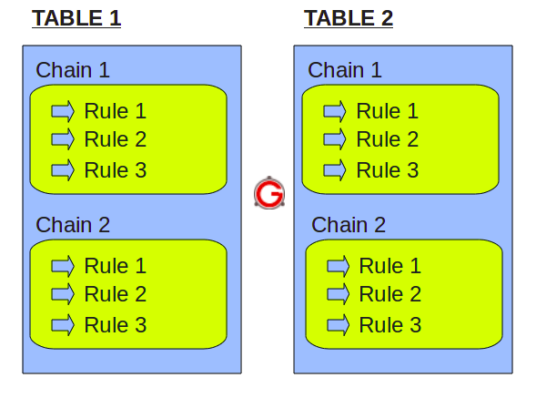
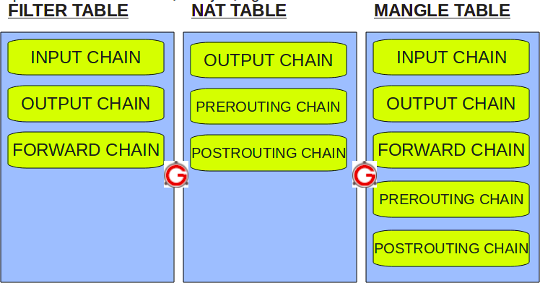
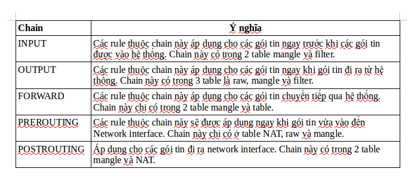
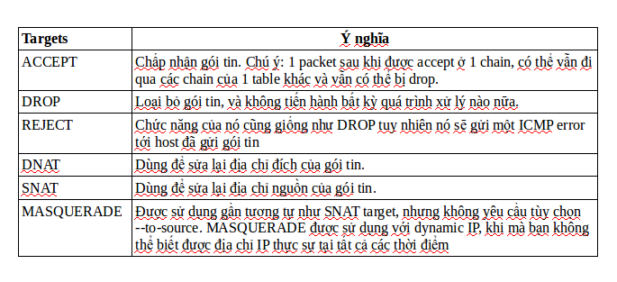
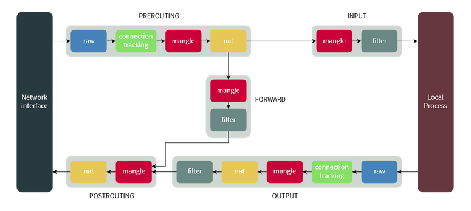
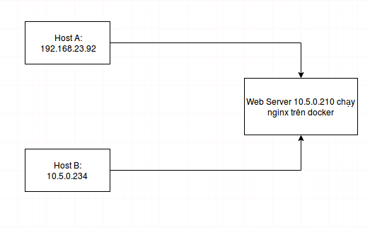

# Tìm hiểu về Iptables.

- **Mục lục:**

   1.Iptables là gì?
   2.Cơ chế hoạt đông và các thành phần của Iptables.
   3.Luồng xử lý gói tin trong Iptables.
   4.Các rule trong iptables.
   5.Các tùy chọn.
   6.Lab
   7.Tổng kết
   

**1. Iptables là gì?**

- ***1.1. Giới thiệu***
  - Trước hết để tìm hiểu về Iptables, các bạn cần phải nắm được các tham số cơ bản trong gói tin: source ip, destination ip, port, TOS, TTL và hiểu được NAT là gì. Các bạn có thể tham khảo về NAT trong bài sau: https://github.com/thangtq710/Ghi-chep-NAT-DNAT-SNAT.
  - Iptables là một ứng dụng tường lửa cực kì mạnh mẽ, được tích hợp mặc định trong hầu hết các bản phân phối của hệ điều hành Linux (CentOS, Ubuntu…), chính xác hơn là iptables/netfilter. Iptables hoạt động dựa trên việc phân loại và thực thi các package ra/vào theo các quy tắc được thiết lập từ trước. Nó có khả năng phân tích, lọc gói tin 1 cách hiệu quả, cung cấp khả năng NAT, có khả năng ngăn chặn một số cơ chế tấn công theo kiểu DoS.
  - Iptables/Netfilter gồm 2 phần là Netfilter ở trong nhân Linux và Iptables nằm ngoài nhân. Iptables chịu trách nhiệm giao tiếp với người dùng và sau đó đẩy các rules của người dùng vào cho Netfiler xử lí. Netfilter làm việc trực tiếp trong nhân, nó tiến hành lọc, xử lí các gói dữ liệu ở mức IP.

- ***1.2. Sự khác biệt trên các distro khác nhau.***
  * Trên CentOS, iptables được mặc định cài đặt với hệ điều hành.
  * Trên ubuntu, ufw được mặc định cài đặt với hệ điều hành. Về bản chất, ufw is a frontend for iptables. Tức có nghĩa là thay vì gõ lệnh iptables, thì các bạn gõ lệnh ufw. Sau đó, ufw sẽ chuyển các lệnh của ufw sang tập lệnh của iptables. Tất nhiên, iptables sẽ xử lý các quy tắc, chính sách đó. Lệnh ufw là dễ dàng hơn cho những người mới bắt đầu tìm hiểu về firewall. ufw cung cấp framework để quản lý netfilter, và giao diện command-line thân thiện để quản lý firewall.

**2. Cơ chế hoạt động - các thành phần của Iptables:**

- Cơ chế lọc gói tin của Iptable được xây dựng dựa trên 3 thành phần cơ bản đó là **table**, **chain** và **target**.

- Iptables sử dụng table để định nghĩa các rules cụ thể cho các gói tin, mỗi table có thể gắn nhiều chain, mỗi 1 chain là 1 bộ quy tắc. Bây giờ chúng ta sẽ đi tìm hiểu cụ thể từng thành phần trong Iptables.



- **Table**: Các phiên bản Linux hiện nay có 4 loại table khác nhau:

  * Đầu tiên phải kể đến filter table: Table này quen thuộc và hay được sử dụng nhất. table này nhằm quyết định liệu gói tin có được chuyển đến địa chỉ đích hay không.
  
  * Tiếp theo là mangle table: Table này liên quan đến việc sửa head của gói tin, ví dụ chỉnh sửa giá trị các trường TTL, MTU, Type of Service.
  
  * Table Nat: Table này cho phép route các gói tin đến các host khác nhau trong mạng NAT table cách thay đổi IP nguồn và IP đích của gói tin. Table này cho phép kết nối đến các dịch vụ không được truy cập trực tiếp được do đang trong mạng NAT.

  * Table raw: 1 gói tin có thể thuộc một kết nối mới hoặc cũng có thể là của 1 một kết nối đã tồn tại. Table raw cho phép bạn làm việc với gói tin trước khi kernel kiểm tra trạng thái gói tin.
  
- Sơ đồ sau cho thấy ba bảng quan trọng trong iptables.


 
- **Chains**: Mỗi table được tạo với một số chain nhất định. Chains cho phép lọc gói tin tại các điểm khác nhau. Iptable có thể thiết lập với các chains sau:



- **Targets**:



-> Để hiểu rõ hơn quá trình xử lí gói tin của iptables chúng ta sẽ tìm hiểu ở phần tiếp theo.

**3. Luồng xử lý gói tin trong Iptables:**



***3.1. Gói tin đi từ ngoài đến:***
  - Đầu tiên gói tin đi vào bảng RAW, chain PREROUTING. Tại đây, IPTables sẽ xử lý là có theo dõi kết nối này hay không. 1 gói tin có thể thuộc một kết nối mới hoặc cũng có thể là của 1 một kết nối đã tồn tại. 
  - Sau đó, gói tin chuyển đến bảng Mangle, chain PREROUTING. Tại đây, Nếu cần thiết phải thay đổi một số giá trị trong header của gói tin (TTL, ToS...), trước khi được định tuyến, thì nó sẽ xử lý ở bảng này
  - Tiếp theo, gói tin đi vào bảng NAT, chain PREROUTING. Tại đây, địa chỉ đích của gói tin có thể bị thay đổi hoặc không, qua bộ Routing và sẽ quyết định xem gói tin đó thuộc firewall hay không:
    * TH1: **gói tin đó là của firewall**: gói tin sẽ đi qua table Mangle, chain input, nếu cần chỉnh sửa các giá trị header của gói tin trước khi đi vào bảng filter thì được thực hiện tại đây, và đến table Filter. Tại đây gói tin sẽ được áp dụng các rules và ứng với mỗi rule cụ thể sẽ được áp dụng với target. Sau đó đến Local Process (chính là các dịch vụ trên server).
	* TH2: **gói tin không phải của firewall**: sẽ được đưa đến table Mangle với chain FORWARD đến bảng filter với chain FORWARD. Ở đây, gói tin sẽ được lọc với các rules. Nếu rules cho phép đi qua, gói tin sẽ chuyển đến  table Mangle và NAT với chain POSTROUTING để thực hiên việc chuyển đổi địa chỉ nguồn với target SNAT nếu cần thiết.
	
***3.2. Gói tin là của Firewall đi ra (Các service trên server firewall đi ra, có thể là khởi tạo một kết nối mới hoặc trả lời các kết nối đi vào):***
  - Khi firewall cần gửi dữ liệu ra ngoài. Gói dữ liệu sẽ được dẫn vào đi qua sự kiểm tra của OUTPUT chain trong mangle table (nếu cần), tiếp đó là kiểm tra trong OUTPUT chain của nat table để xem DNAT (DNAT sẽ thay đổi địa chỉ đến) có cần hay không và OUTPUT chain của filter table sẽ kiểm tra gói dữ liệu nhằm phát hiện các gói dữ liệu không được phép gởi đi.Cuối cùng trước khi gói dữ liệu được đưa ra lại Internet, SNAT and QoS sẽ được kiểm tra trong POSTROUTING chain.
  
**4. Các rule trong iptables**

Để xem các rule đang có trong iptables( nếu ko có options -t thì mặc định sẽ list các rule ở filter table), dùng lệnh:  

iptables -L -v (iptables -t filter -L -v):

```
TARGET    PROT   OPT  IN   OUT   SOURCE     DESTINATION

ACCEPT    all    --   lo   any   anywhere   anywhere

ACCEPT    all    --   any  any   anywhere   anywhere    ctstate  RELATED,ESTABLISHED

ACCEPT    tcp    --   any  any   anywhere   anywhere    tcp      dpt:ssh

ACCEPT    tcp    --   any  any   anywhere   anywhere    tcp      dpt:http

ACCEPT    tcp    --   any  any   anywhere   anywhere    tcp      dpt:https

DROP      all    --   any  any   anywhere   anywhere
```

Ý nghĩa của từng cột như sau:
  * TARGET: Hành động sẽ thực thi.
  * PROT: Là viết tắt của chữ Protocol, nghĩa là giao thức. Tức là các giao thức sẽ được áp dụng để thực thi quy tắc này. Ở đây chúng ta có 3 lựa chọn là all, tcp hoặc udp. Các ứng dụng như SSH, FTP, sFTP,..đều sử dụng giao thức kiểu TCP.
  * IN: chỉ ra rule sẽ áp dụng cho các gói tin đi vào từ interface nào, chẳng hạn như lo, eth0, eth1 hoặc any là áp dụng cho tất cả interface.
  * OUT: Tương tự như IN, chỉ ra rule sẽ áp dụng cho các gói tin đi ra từ interface nào.
  * DESTINATION: Địa chỉ của lượt truy cập được phép áp dụng quy tắc.

Để dễ hiểu hơn, mình giải thích các quy tắc ở table trên cho các bạn:

```
ACCEPT    all    --   lo   any   anywhere   anywhere
```

Chấp nhận toàn bộ gói tin từ interface lo, lo ở đây nghĩa là “Loopback Interface“, là interface ảo nội bộ, chẳng hạn như IP 127.0.0.1 là kết nối qua thiết bị này.

```
ACCEPT    all    --   any  any   anywhere   anywhere    ctstate  RELATED,ESTABLISHED
```

Chấp nhận toàn bộ gói tin của kết nối hiện tại. Nghĩa là khi bạn đang ở trong SSH và sửa đổi lại Firewall, nó sẽ không đá bạn ra khỏi SSH nếu bạn không thỏa mãn quy tắc.

```
ACCEPT    tcp    --   any  any   anywhere   anywhere    tcp      dpt:ssh
```

Chấp nhận toàn bộ gói tin của giao thức SSH ở bất cứ interface nào, với bất kể IP nguồn và đích là bao nhiêu. Mặc định sẽ hiển thị dpt:ssh để biểu diễn cổng 22 của SSH, nếu bạn đổi SSH thành cổng khác thì sẽ hiển thị số cổng.

```
ACCEPT    tcp    --   any  any   anywhere   anywhere    tcp      dpt:http
```

Cho phép kết nối vào cổng 80, mặc định sẽ biểu diễn thành chữ http.

```
ACCEPT    tcp    --   any  any   anywhere   anywhere    tcp      dpt:https
```

Cho phép kết nối vào cổng 443, mặc định nó sẽ biểu diễn thành chữ https.

```
DROP      all    --   any  any   anywhere   anywhere
```

Loại bỏ tất cả các gói tin nếu không khớp với các rule ở trên.

Giờ nếu bạn muốn thêm một rule mới thì làm thế nào? Sau đây là một số tùy chọn khi bạn thực hiện.

**5. Các tùy chọn**: 

***Các tùy chọn để chỉ định thông số***

– chỉ định tên table: -t

```
ví dụ -t filter, -t nat, .. nếu không chỉ định table, giá trị mặc định là filter table
```

– chỉ đinh loại giao thức: -p

```
ví dụ -p tcp, -p udp hoặc -p ! udp để chỉ định các giao thức không phải là udp
```

– chỉ định card mạng vào: -i 

```
ví dụ: -i eth0, -i lo
```

– chỉ định card mạng ra: -o

```
ví dụ: -o eth0
```

– chỉ định địa chỉ IP nguồn: -s <địa_chỉ_ip_nguồn>

```
ví dụ: -s 192.168.0.0/24 (mạng 192.168.0 với 24 bít mạng), -s 192.168.0.1-192.168.0.3 (các IP 192.168.0.1, 192.168.0.2, 192.168.0.3).
```

– chỉ định địa chỉ IP đích: -d <địa_chỉ_ip_đích>, tương tự như -s


– chỉ định cổng nguồn: --sport ,

```
ví dụ: –sport 21 (cổng 21), --sport 22:88 (các cổng 22 .. 88), --sport 0 (các cổng <=80), –sport 22: (các cổng >=22)
```

– chỉ định cổng đích: --dport , tương tự như --sport

***Các tùy chọn để thao tác với chain***

– tạo chain mới: iptables -N

– xóa hết các rule đã tạo trong chain: iptables -X

– đặt chính sách cho các chain `built-in` (INPUT, OUTPUT & FORWARD): iptables -P , ví dụ: iptables -P INPUT ACCEPT để chấp nhận các packet vào chain INPUT

– liệt kê các rule có trong chain: iptables -L

– xóa các rule có trong chain (flush chain): iptables -F


***Các tùy chọn để thao tác với rule***

– thêm rule: -A (append)

– xóa rule: -D (delete)

– thay thế rule: -R (replace)

– chèn thêm rule: -I (insert)


**6. Lab**

- Dưới đây mình sẽ thực hiện 1 bài lab cơ bản khai thác bảng filter và bảng NAT của Iptables.



- Mục đích: 
  * Chỉ cho phép ssh từ 10.5.0.234 -> 10.5.0.210. 
  * Build container nginx trên server 10.5.0.210 để xem cơ chế NAT của Iptables trên docker.

***a.Khai thác bảng filter***

- Kiểm tra xem iptables đã được cài đặt chưa, và list các rule mặc định của bảng filter:

  iptables -t filter -L -v

```
Chain INPUT (policy ACCEPT 26690 packets, 5171K bytes)
 pkts bytes target     prot opt in     out     source               destination         

Chain FORWARD (policy DROP 0 packets, 0 bytes)
 pkts bytes target     prot opt in     out     source               destination         

Chain OUTPUT (policy ACCEPT 26342 packets, 1219K bytes)
 pkts bytes target     prot opt in     out     source               destination         

Chain DOCKER (0 references)
 pkts bytes target     prot opt in     out     source               destination         

Chain DOCKER-ISOLATION (0 references)
 pkts bytes target     prot opt in     out     source               destination
```
- Ta thực hiện config iptables chỉ cho phép ssh từ 10.5.0.234 -> 10.5.0.210

```
iptables -t filter -A INPUT -p tcp --dport 22 -s 10.5.0.234 -j ACCEPT
iptables -t filter -A INPUT -p tcp --dport 22 -j DROP
```
- Thực hiện check các rule mới được áp dụng:

```
[root@sysadmin-test-0 ~]# iptables -L -v          
Chain INPUT (policy ACCEPT 221K packets, 40M bytes)
 pkts bytes target     prot opt in     out     source               destination         
    4   216 ACCEPT     tcp  --  any    any     10.5.0.234           anywhere             tcp dpt:ssh
    7   420 DROP       tcp  --  any    any     anywhere             anywhere             tcp dpt:ssh

Chain FORWARD (policy DROP 0 packets, 0 bytes)
 pkts bytes target     prot opt in     out     source               destination         
   38  5433 DOCKER-ISOLATION  all  --  any    any     anywhere             anywhere            
   22  1415 DOCKER     all  --  any    docker0  anywhere             anywhere            
    0     0 ACCEPT     all  --  any    docker0  anywhere             anywhere             ctstate RELATED,ESTABLISHED
   16  4018 ACCEPT     all  --  docker0 !docker0  anywhere             anywhere            
    0     0 ACCEPT     all  --  docker0 docker0  anywhere             anywhere            

Chain OUTPUT (policy ACCEPT 218K packets, 10M bytes)
 pkts bytes target     prot opt in     out     source               destination       
```

- Kết quả ta thử thực hiện check ssh đến 10.5.0.210:
  * Ở trên 10.5.0.234 ta có thể ssh -> 10.5.0.210 
  ```
  telnet 10.5.0.210 22
  Trying 10.5.0.210...
  Connected to 10.5.0.210.
  Escape character is '^]'.
  SSH-2.0-OpenSSH_7.4
  ```
  
  * Ở trên máy khác (192.168.23.92) , sẽ không ssh được đến 10.5.0.210
  ```
  telnet 10.5.0.210 22
  Trying 10.5.0.210...
  telnet: Unable to connect to remote host: Connection timed out
  ```

***b. Build container nginx để xem cơ chế NAT iptables:***

- Check bảng NAT trước khi build container nginx: iptables -t nat -L
  
```
Chain PREROUTING (policy ACCEPT)
target     prot opt source               destination         
DOCKER     all  --  anywhere             anywhere             ADDRTYPE match dst-type LOCAL

Chain INPUT (policy ACCEPT)
target     prot opt source               destination         

Chain OUTPUT (policy ACCEPT)
target     prot opt source               destination         
DOCKER     all  --  anywhere            !loopback/8           ADDRTYPE match dst-type LOCAL

Chain POSTROUTING (policy ACCEPT)
target     prot opt source               destination         
MASQUERADE  all  --  172.17.0.0/16        anywhere            

Chain DOCKER (2 references)
target     prot opt source               destination         
RETURN     all  --  anywhere             anywhere        
```

- Ta thực hiện build container nginx:

```
docker run --name test-nginx -p 80:80 -d nginx
```
Câu lệnh trên ta thực hiện run 1 container nginx ở background, map port 80 trong container ra host   

- Check container nginx có đang chạy ko:

```
[root@sysadmin-test-0 ~]# docker ps
CONTAINER ID        IMAGE               COMMAND                  CREATED             STATUS              PORTS                NAMES
ff2dbb1eef19        nginx               "nginx -g 'daemon ..."   4 seconds ago       Up 4 seconds        0.0.0.0:80->80/tcp   test-nginx
```
- Mỗi một container trong docker sẽ được nhận 1 IP riêng, để kiểm tra IP của container trên ta thực hiện lệnh sau:

```
[root@sysadmin-test-0 ~]# docker inspect ff2dbb1eef19 | grep IPAddress
            "SecondaryIPAddresses": null,
            "IPAddress": "172.17.0.2",

```

- Trên server 10.5.0.210 ta show bảng nat của iptables: 

```
[root@sysadmin-test-0 ~]# iptables -t nat -L
Chain PREROUTING (policy ACCEPT)
target     prot opt source               destination         
DOCKER     all  --  anywhere             anywhere             ADDRTYPE match dst-type LOCAL

Chain INPUT (policy ACCEPT)
target     prot opt source               destination         

Chain OUTPUT (policy ACCEPT)
target     prot opt source               destination         
DOCKER     all  --  anywhere            !loopback/8           ADDRTYPE match dst-type LOCAL

Chain POSTROUTING (policy ACCEPT)
target     prot opt source               destination         
MASQUERADE  all  --  172.17.0.0/16        anywhere            
MASQUERADE  tcp  --  172.17.0.2           172.17.0.2           tcp dpt:http

Chain DOCKER (2 references)
target     prot opt source               destination         
RETURN     all  --  anywhere             anywhere            
DNAT       tcp  --  anywhere             anywhere             tcp dpt:http to:172.17.0.2:80
```

- Trên máy 192.168.23.92, ta thực hiện check service nginx trên server 10.5.0.210 có chạy không:

```
thangtq@thangtq:~$ curl -s -I 10.5.0.210 | grep HTTP
HTTP/1.1 200 OK
```
-> Khi có 1 gói tin từ ngoài được gửi đến 10.5.0.210:80. Iptables sẽ thực hiện DNAT 10.5.0.210:80 -> 172.17.0.2:80.

**7. Lời kết**

- Trên đây là những đúc rút của tôi sau quá trình tìm hiểu về iptables. Iptables là một mảng kiến thức khá rộng và khó, rất mong các bạn đọc và cùng chia sẻ những kiến thức về iptables.
- Tài liệu tham khảo: 
  * https://www.booleanworld.com/depth-guide-iptables-linux-firewall/
  * https://github.com/hocchudong/thuctap012017/tree/master/XuanSon/Security/Iptables
